# DCFG Dataverse Schema — Entity Relationship Diagram

**Generated:** 2026-04-03
**Source:** DCFG_Schema_Consolidated.md (19 tables)
**For:** Grace — tech demo follow-up

---

## How to Read This Diagram

- **PK** = Primary Key, **FK** = Foreign Key (Lookup)
- Arrows point from child → parent (N:1 direction)
- Self-referencing relationship on `dcfg_contract` supports amendment chains
- `dcfg_vendor` is the top-level entity — Customer and Vendor are **mutually exclusive** at the top level
- Contracts reference both MSAs (terms) and Properties (locations)
- Work Orders need a location; MSAs do NOT (entity-level agreements)

---

## Mermaid ER Diagram

```mermaid
erDiagram

    dcfg_vendor {
        guid dcfg_vendorid PK
        string dcfg_name
        string dcfg_legal_name
        string dcfg_address
        choice dcfg_contract_family "Bancroft | Decades"
        bool dcfg_active_flag
    }

    dcfg_customer {
        guid dcfg_customerid PK
        string dcfg_name
        string dcfg_primary_contact_name
        string dcfg_primary_contact_email
        string dcfg_president_name
        string dcfg_president_title
        bool dcfg_active_flag
        guid dcfg_vendor_id FK
    }

    dcfg_msa {
        guid dcfg_msaid PK
        string dcfg_name
        date dcfg_msa_date
        choice dcfg_status "Draft thru Inactive"
        choice dcfg_exhibit_type "PackageA | B | C"
        currency dcfg_budget_total
        currency dcfg_budget_committed "READ-ONLY"
        bool dcfg_active_flag
        guid dcfg_customer_id FK
        guid dcfg_vendor_id FK
    }

    dcfg_msa_rate {
        guid dcfg_msa_rateid PK
        string dcfg_name
        currency dcfg_membership_rate
        currency dcfg_onboarding_rate
        guid dcfg_msa_id FK
        guid dcfg_location_type_id FK
    }

    dcfg_location_type {
        guid dcfg_location_typeid PK
        string dcfg_name "GroupHome | DayProgram | School | Admin"
        string dcfg_description
    }

    dcfg_contract {
        guid dcfg_contractid PK
        string dcfg_name
        string dcfg_contract_number
        choice dcfg_status "Draft thru Declined"
        choice dcfg_contract_family "Bancroft | Decades"
        int dcfg_amendment_number
        currency dcfg_budget_committed "READ-ONLY"
        guid dcfg_msa_id FK
        guid dcfg_property_id FK
        guid dcfg_parent_contract_id FK "self-ref amendments"
        guid dcfg_program_id FK
    }

    dcfg_contract_line {
        guid dcfg_contract_lineid PK
        string dcfg_name
        int dcfg_item_number
        string dcfg_description
        currency dcfg_amount
        guid dcfg_contract_id FK
        guid dcfg_cost_code_id FK
    }

    dcfg_property {
        guid dcfg_propertyid PK
        string dcfg_name
        string dcfg_address
        string dcfg_city
        string dcfg_state
        string dcfg_contact_person
        string dcfg_contact_email
        bool dcfg_active_flag
        guid dcfg_customer_id FK
        guid dcfg_location_type_id FK
    }

    dcfg_property_detail {
        guid dcfg_property_detailid PK
        string dcfg_name
        guid dcfg_property_id FK
    }

    dcfg_location_document {
        guid dcfg_location_documentid PK
        string dcfg_name
        guid dcfg_property_id FK
    }

    dcfg_ap_cost_code {
        guid dcfg_ap_cost_codeid PK
        string dcfg_name
        string dcfg_customer_ap_code
    }

    dcfg_program {
        guid dcfg_programid PK
        string dcfg_name
        currency dcfg_budget_total
        currency dcfg_budget_committed "READ-ONLY"
        guid dcfg_customer_id FK
    }

    dcfg_onboarding_case {
        guid dcfg_onboarding_caseid PK
        string dcfg_name
        choice dcfg_status "NotStarted thru Closed"
        choice dcfg_phase "SalesProposal thru GoLive"
        guid dcfg_customer_id FK
        guid dcfg_msa_id FK
    }

    dcfg_onboarding_checklist {
        guid dcfg_onboarding_checklistid PK
        string dcfg_name
        guid dcfg_onboarding_case_id FK
    }

    dcfg_document_template {
        guid dcfg_document_templateid PK
        string dcfg_name
        choice dcfg_exhibit_type "PackageA | B | C"
    }

    dcfg_document_output {
        guid dcfg_document_outputid PK
        string dcfg_name
        guid dcfg_template_id FK
    }

    dcfg_template_field {
        guid dcfg_template_fieldid PK
        string dcfg_name
        string dcfg_field_name
        string dcfg_source_entity
        string dcfg_source_column
        bool dcfg_is_required
        guid dcfg_document_template_id FK
    }

    dcfg_audit_log {
        guid dcfg_audit_logid PK
        string dcfg_name
        choice dcfg_action_type "Generated thru Other"
    }

    dcfg_send_queue {
        guid dcfg_send_queueid PK
        string dcfg_name
        guid dcfg_contract_id FK
    }

    %% === RELATIONSHIPS ===

    %% Top-level hierarchy
    dcfg_customer ||--o{ dcfg_vendor : "belongs to vendor"

    %% MSA relationships
    dcfg_msa }o--|| dcfg_customer : "customer_id"
    dcfg_msa }o--|| dcfg_vendor : "vendor_id"
    dcfg_msa_rate }o--|| dcfg_msa : "msa_id"
    dcfg_msa_rate }o--o| dcfg_location_type : "location_type_id"

    %% Contract relationships
    dcfg_contract }o--o| dcfg_msa : "msa_id"
    dcfg_contract }o--o| dcfg_property : "property_id"
    dcfg_contract }o--o| dcfg_contract : "parent_contract_id (amendments)"
    dcfg_contract }o--o| dcfg_program : "program_id"
    dcfg_contract_line }o--|| dcfg_contract : "contract_id"
    dcfg_contract_line }o--o| dcfg_ap_cost_code : "cost_code_id"

    %% Property (Location) relationships
    dcfg_property }o--o| dcfg_customer : "customer_id"
    dcfg_property }o--o| dcfg_location_type : "location_type_id"
    dcfg_property_detail }o--o| dcfg_property : "property_id"
    dcfg_location_document }o--o| dcfg_property : "property_id"

    %% Program
    dcfg_program }o--o| dcfg_customer : "customer_id"

    %% Onboarding
    dcfg_onboarding_case }o--o| dcfg_customer : "customer_id"
    dcfg_onboarding_case }o--o| dcfg_msa : "msa_id"
    dcfg_onboarding_checklist }o--|| dcfg_onboarding_case : "case_id"

    %% Document generation
    dcfg_template_field }o--|| dcfg_document_template : "template_id"
    dcfg_document_output }o--o| dcfg_document_template : "template_id"

    %% Send queue
    dcfg_send_queue }o--o| dcfg_contract : "contract_id"
```



---

## Key Concepts for Grace

### Entity Hierarchy (Top-Down)

```
VENDOR (Decades, Bancroft)
  └── CUSTOMER (accounts managed by vendor)
        ├── MSA (master agreement — entity-level, no location)
        │     └── MSA_RATE (pricing per location type)
        ├── PROPERTY (physical locations)
        │     ├── PROPERTY_DETAIL (extended attributes)
        │     └── LOCATION_DOCUMENT (compliance docs)
        ├── CONTRACT (work orders — location-level)
        │     ├── CONTRACT_LINE (Exhibit A line items)
        │     └── SEND_QUEUE (DocuSign queue)
        ├── PROGRAM (budget buckets)
        └── ONBOARDING_CASE
              └── ONBOARDING_CHECKLIST (16 steps)
```

### Mutually Exclusive Top-Level Entities

- **Vendor** = the parent company (Decades, Bancroft)
- **Customer** = the account managed by a vendor
- A record is one or the other, never both
- Contracts sit at the intersection: they reference a Customer (via MSA) AND a Property (location)

### Contract Lifecycle

```
MSA (entity-level terms) → Work Order (location-level scope) → Amendment (versioned changes)
```

- MSAs bind Customer + Vendor with pricing terms
- Work Orders bind MSA + specific Property with line items
- Amendments reference a parent Work Order (self-referencing FK)

### Document Generation Pipeline

```
DOCUMENT_TEMPLATE → TEMPLATE_FIELD (merge fields)
                  → DOCUMENT_OUTPUT (generated files)
```
